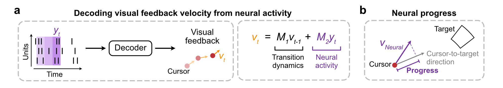

## bci-analysis

This repository contains code developed to analyse neural data during a  brain-computer interface (BCI) task. In our study, two rhesus monkeys performed a BCI-controlled center-out-reach task under different levels of visual feedback uncertainty. On each trial, monkeys either controlled a low-uncertainty cursor or a high-uncertainty cloud of dots. Neural recordings were collected from multi-electrode arrays implanted in motor and premotor cortex. 

These analyses are part of a larger study published in [*Amann et al., 2025*](https://www.nature.com/articles/s41467-025-58738-x). 

#### Neural activity classification

`neural_analysis.py` contains code for comparing how neural activity encodes task information across different uncertainty levels. The task variable decoded was the instructed target direction of the reach. 

Two types of classification are tested:

##### Wtihin-level classification over time
Neural activity from sliding time-windows was classified into a target direction. SVM classifiers were trained and tested on each time-window independently using trials from each uncertainty level.

##### Cross-level classification in time window
Generalization across uncertainty levels was also assessed by training classifiers on low-uncertainty trials and testing them on low- and high-uncertainty ones. A drop in classification accuracy between them would reflect reduced generalization. Neural activity from a time window (-50 to 150 ms from go cue) was used as input.

#### Neural progress

During our experiments, neural activity was decoded into velocity vector in real time via a velocity-based Kalman filter (a). Part of the decoded velocity vector reflects the projection of neural activity onto the velocity space, known as the neural vector. 

The neural progress (b) is defined as the projection of the neural vector onto the cursor-to-target direction at each time step, reflecting how effectively neural activity drives movement toward the target.

  

`bci_progress.py` contains code to quantify and analyze neural progress across uncertainty levels. 

Example analyses:
- Neural progress over time, aligned to go-cue.
- Time-averaged neural progress in specific time windows.
- Neural progress during direct and non-direct reaches (those with corrective submovents).
- Neural progress at submovement start, grouped by whether the submovement was toward or away the target.

