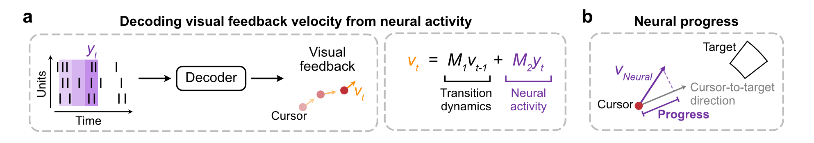

## bci-analysis

Analysis code for a brain-computer interface (BCI) study examining how visual feedback uncertainty affects neural population dynamics during motor control. Two rhesus macaques performed a BCI-controlled center-out reach task under two uncertainty conditions: a low-uncertainty cursor (CRS) and a high-uncertainty cloud of dots (CLD). Neural activity was recorded from multi-electrode arrays implanted in motor and premotor cortex.

These analyses are part of a larger study published in
**Amann et al., 2025**. [[Link]](https://www.nature.com/articles/s41467-025-58738-x)

---

### Repository Structure

```
bci-analysis/
├── neural_analysis.py      # SVM classification of neural activity
├── bci_progress.py         # Neural progress analysis
├── neural_functions.py     # Core analysis functions
├── utils.py                # General-purpose utilities
└── images/
    └── bci_gh.png
```

---

### Analyses

#### Neural Activity Classification — `neural_analysis.py`

Decodes instructed reach direction from neural population activity using support vector machines (SVMs), and compares encoding across uncertainty conditions.

**Within-level classification over time**:
Sliding-window SVMs are trained and tested on trials from each uncertainty level independently. This quantifies how target direction information evolves relative to the go cue.

**Cross-level classification**:
Classifiers trained on low-uncertainty (CRS) trials are tested on both CRS and CLD trials in a fixed peri-go-cue window (-50 to 150 ms). A reduction in accuracy on CLD trials relative to CRS trials indicates reduced generalization of the neural population code across conditions.

#### Neural Progress — `bci_progress.py`

During experiments, neural activity was decoded in real time into a velocity command via a velocity-based Kalman filter. The component of this decoded velocity that reflects the projection of neural activity onto velocity space is referred to as the **neural vector**.

**Neural progress** is defined as the projection of the neural vector onto the cursor-to-target direction at each time step, a scalar quantity that captures how effectively neural activity drives movement toward the target.

<p align="left">
  
</p>

Key analyses include:

- Neural progress over time, aligned to the go cue
- Time-averaged neural progress within specific windows
- Neural progress on direct vs. corrective (multi-submovement) reaches
- Neural progress at submovement onset, stratified by whether the submovement was directed toward or away from the target

---

### Code Overview

#### `neural_functions.py`

Core functions for data loading, trial alignment, neural decoding, and progress computation:

| Function                   | Description                                                             |
| -------------------------- | ----------------------------------------------------------------------- |
| `task_selection()`         | Parses task files, filters to post-calibration successful trials        |
| `trackers_selection()`     | Extracts cursor position/velocity time series                           |
| `reconstruct_KF()`         | Simulates Kalman filter decoding from spike data and decoder parameters |
| `extract_trial_data()`     | Aligns spike data to go cue; returns per-trial spike density matrices   |
| `classify_neural_window()` | Cross-validated SVM over sliding time windows                           |
| `classify_neural_cross()`  | Cross-condition SVM generalization                                      |
| `get_progress_*()`         | Family of functions computing neural progress metrics                   |
| `get_submov_*()`           | Submovement detection and nearest-neighbor analysis                     |
| `bin_traj()`               | Time-aligned trajectory averaging                                       |

#### `utils.py`

General-purpose utilities including file parsing (`txt2df`), angular math (`angle_wrap`, `angle_between`), statistical testing (`stat_test`), and trial-count balancing across conditions (`equal_cond_df`).

---

### Data

Data are not included in this repository. Per-session data files are expected at `/path/to/BMI/pool_py/{subject}/` with the following naming conventions:

| File pattern              | Contents                                 |
| ------------------------- | ---------------------------------------- |
| `*_spikes_s.csv`          | Binned spike counts (neurons × time)     |
| `*_BCI_Task.txt`          | Trial-by-trial task data                 |
| `*_BCI_trackers.txt`      | Cursor position and velocity time series |
| `*_calibrated_values.mat` | Kalman filter decoder parameters         |

Processed DataFrames are cached as `.pkl` files and reloaded via the `overwrite` flag at the top of each script.

---

### Requirements

- Python 3
- NumPy
- Pandas
- SciPy
- scikit-learn
- Matplotlib
- Seaborn
- tqdm
